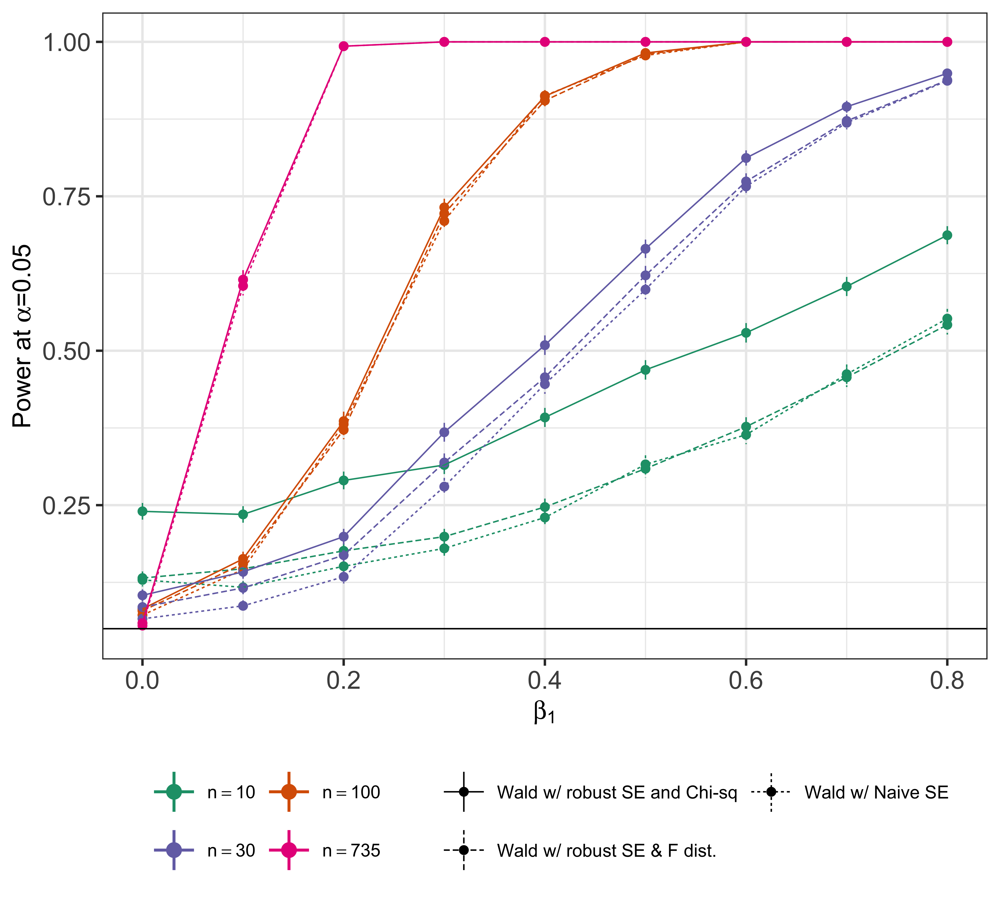
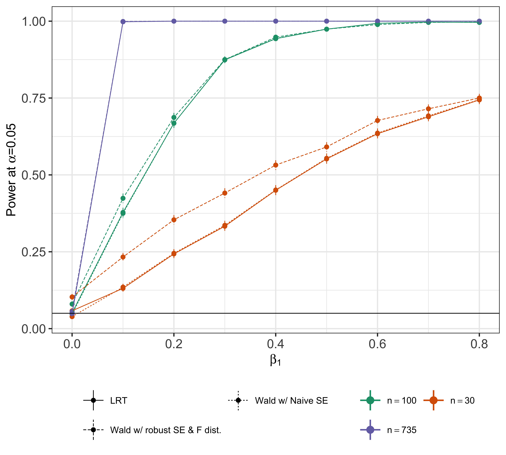
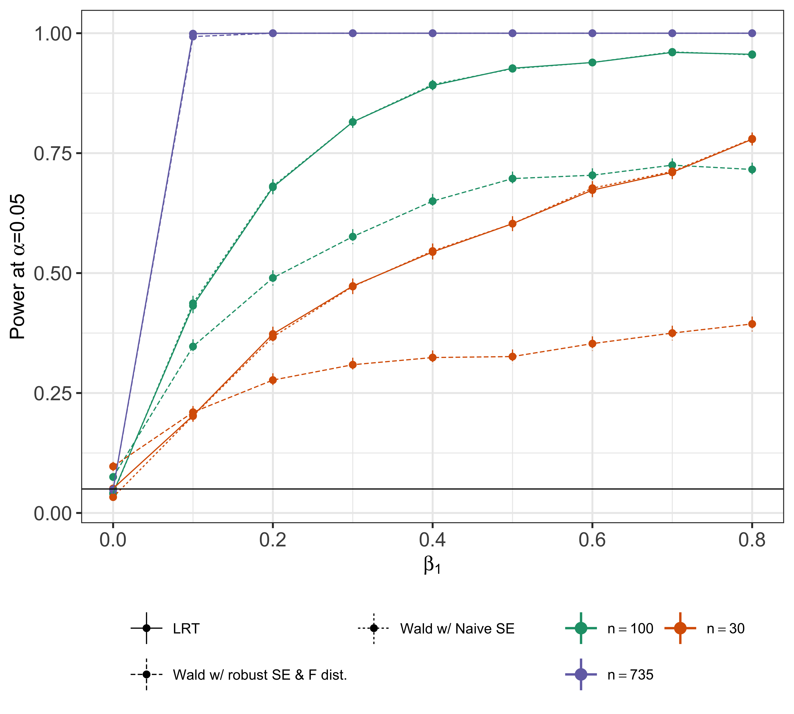
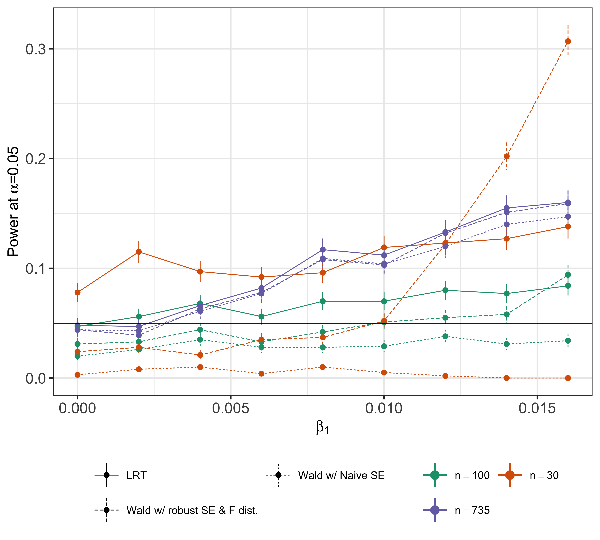

# Estimating the power of a joint test in lm/glm with robust SE

This set of simulation code was used in `rigr` package development during summer 2022. The main purpose of the code is to understand the power behaviour of `anova` and `lincom` functions in `rigr`.

1. The code in `joint_test_lm.R` performs power simulation for a linear regression model with hetereoskedastic error (drawn from an independent gamma distribution) and reproduces the following figure.

 

 

2. The code in `anova_glm_test_poisson.R` performs power simulation for a Poisson regression model and reproduces the following figure.

 

 

3. The code in `anova_glm_test_poisson.R` performs power simulation for a Poisson regression model with over-dispersed negative binomial data and reproduces the following figure.

 

 

4. The code in `anova_glm_test_logistic.R` performs power simulation for a logistic regression model and reproduces the following figure. **Note: the simulation settings in this code lead to logistic regressions that do not converge sometimes; in the future new sets of simulation settings will be investigated**

 

 
